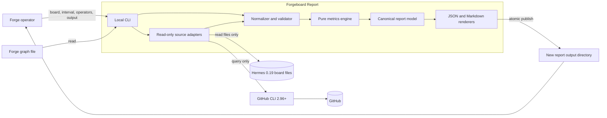

# Forgeboard Report — Architecture

**Status:** proposed for human sign-off · 2026-07-29

**Governing requirements:** `docs/REQUIREMENTS.md`, signed off 2026-07-29

**Decision records:** ADR-0001 through ADR-0005

## Architectural intent

Forgeboard Report is a local, one-shot Python 3.12 command. It captures one
Hermes board and the referenced GitHub pull requests without mutating either,
normalizes those records into an immutable in-memory snapshot, computes metrics
with pure functions, and atomically publishes one JSON/Markdown report bundle.
It is not a service, does not persist source state, and owns no credentials.

The design optimizes for auditability over best-effort output: a reviewer can
trace every value to stable source ids, and missing core evidence stops the
report instead of producing a plausible number.

## Requirements attack and explicit assumptions

The signed requirements were challenged before choosing components. These are
the ranked gaps and the design assumptions that resolve them. They are part of
this proposed architecture and require sign-off.

| Rank | Gap or failure mode | Explicit resolution |
| ---: | --- | --- |
| 1 | Hermes' apparently read-only public JSON path is not guaranteed read-only: 0.19.0 `kanban list` recomputes readiness. Per-card `show` calls also threaten the live latency budget and omit row ids. | **A-1:** Live Hermes data is captured through read-only file handles into a stable private SQLite copy, per ADR-0001. Public 0.19 JSON is a compatibility oracle, not the live acquisition path. |
| 2 | The period is defined, but most FRs do not say which timestamp controls membership, and causal boundary events may sit outside it. | **A-2:** Each lifecycle record uses its own occurrence timestamp; minimal out-of-period records may be reference context but never aggregate contributions. Exact rules are in ADR-0005. |
| 3 | FR-3 can mean three per-dimension means or one mean pooled across all three scores. | **A-3:** The report emits three arithmetic means—one each for `spec_fidelity`, `scenario_integrity`, and `architectural_conformance`—plus every raw contributing score. |
| 4 | The graph-to-card contract-id representation and duplicate behavior are unstated. A wrong join would contaminate every metric. | **A-4:** A graph entry's unique `id` is the Forge contract id and matches exactly one Hermes task id. Missing or duplicate normalized ids are core errors. Matching is exact and case-sensitive; titles and bodies are never searched. |
| 5 | Blocked runs and block events can describe the same occurrence, while the canonical reason enum is not listed. | **A-5:** A block event and run sharing card/run id are one occurrence; the structured event reason is authoritative and a conflicting structured run reason is a core error. Nonempty canonical `reason_class` strings are preserved exactly. Missing/noncanonical reasons are listed as unclassified. |
| 6 | Comment authors have no specified identity normalization, terminal-state enum, or complete actor taxonomy. Timestamp ties also make "post-dispatch" ambiguous. | **A-6:** Supplied operator ids are nonempty exact strings after surrounding whitespace validation; no case folding occurs. Known Hermes 0.19 structured author namespaces classify worker, prejudge, and automation; unknown authors remain `unclassified`. The terminal card states are `done` and `archived`. Strict timestamp order is required for causal counts. |
| 7 | Parent handoff shape, multiple PRs, missing PRs, unmerged PRs, and retry success are not defined. | **A-7:** Canonical handoff metadata must expose stable PR URLs. The gate is satisfied only when every PR in a parent's canonical implementation handoff is merged; its effective time is the latest `mergedAt`. A reachable unmerged PR is valid failing-gate evidence, while a missing or unreadable required PR fails the report. A successful retry is a later child run with canonical completed outcome. |
| 8 | Canonical verdicts may be absent, malformed, duplicated, or contain non-finite scores. | **A-8:** A declared `forge.judge.v1` record must have a stable verdict id, known verdict outcome, three finite decimal scores, and a finished-run timestamp or the report fails. Valid absence is allowed: quality is unavailable, and completed chunks without a canonical verdict are listed visibly rather than treated as malformed evidence. |
| 9 | FR-8 does not define how two artifacts are emitted, while FR-9 forbids plausible partial output. Bounce rate with zero completed chunks is also unspecified. | **A-9:** One new output directory contains `report.json` and `report.md` and is published atomically per ADR-0003. A zero denominator is `unavailable`, not zero. |
| 10 | Hermes and GitHub cannot be snapshotted in one distributed transaction, and a live board may change during capture. | **A-10:** Each adapter returns one internally coherent snapshot. Hermes capture retries if source bytes change; GitHub PR facts are fetched immediately afterward. Source fingerprints and versions are echoed, but volatile acquisition time is excluded from deterministic output. |

No gap is contradictory after these assumptions. If A-4 or A-7 does not match
real Forge/Hermes fixtures, that is a requirements reconciliation issue rather
than permission to introduce prose parsing.

## System context



The operator invokes a local command with an explicit graph, board, aware
period, operator identity set, and destination. Source adapters are the only
impure boundary. Everything from normalized snapshot through rendering is
deterministic and can run from fixtures with Hermes and GitHub CLI absent.

## Command and process boundary

The public command shape is:

```text
forgeboard-report \
  --board <slug> \
  --graph <path-to-graph.json> \
  --from <aware-iso-8601> \
  --to <aware-iso-8601> \
  --operator <exact-author-id> [--operator ...] \
  --output <new-directory>
```

`--operator` is repeatable and at least one identity is required for FR-5.
`--output` must name a nonexistent destination whose parent exists. Successful
execution creates exactly `report.json` and `report.md`. Source fixture
injection belongs to test/application interfaces, not a second end-user mode.
The output path controls publication only and is not embedded in either
artifact.

The package remains a local console application. Python standard-library
facilities (`argparse`, `dataclasses`, `datetime`, `decimal`, `hashlib`, `json`,
`pathlib`, `sqlite3`, and `subprocess`) are sufficient for the architecture; no
new runtime dependency or deployment unit is introduced.

## Component breakdown

| Component | Responsibility | Primary interface | FRs served |
| --- | --- | --- | --- |
| CLI and application service | Parse explicit inputs, validate the aware half-open interval and operator ids, orchestrate one report, map typed failures to nonzero exits | `run(request, ports) -> PublishedReport` | FR-1, FR-8, FR-9 |
| Graph loader and validator | Read graph bytes, hash inputs, decode unique chunks/`depends_on`, reject missing refs, self-edges, and cycles | `load_graph(path) -> GraphSnapshot` | FR-1, FR-6, FR-7, FR-9 |
| Hermes snapshot adapter | Resolve one board, capture a stable read-only SQLite copy, validate 0.19 schema, read cards/links/runs/events/comments with row ids | `capture(board_slug) -> RawHermesSnapshot` | FR-1, FR-2, FR-3, FR-4, FR-5, FR-6, FR-7, FR-9 |
| GitHub PR adapter | Validate CLI version and query canonical PR ids/merge timestamps in deterministic read-only batches | `fetch(pr_refs) -> tuple[PullRequestFact, ...]` | FR-6, FR-7, FR-9 |
| Normalizer and evidence policy | Parse timestamps/payloads, map contract ids, deduplicate block evidence, decode canonical schemas, classify optional evidence, build evidence index | `normalize(raw_sources, request) -> SourceSnapshot` | FR-1, FR-2, FR-3, FR-4, FR-5, FR-6, FR-7, FR-9 |
| Pure metrics engine | Apply the period and causal rules; calculate bounce, score, block, intervention, and dependency results without I/O | `calculate(snapshot) -> Report` | FR-2, FR-3, FR-4, FR-5, FR-6, FR-7 |
| Canonical report model and evidence index | Hold resolved inputs, source fingerprints, metrics, warnings, unavailable states, and stable references shared by both outputs | immutable `Report` with `forgeboard.report.v1` | FR-1, FR-2, FR-3, FR-4, FR-5, FR-6, FR-7, FR-8 |
| JSON renderer | Serialize the report model under deterministic v1 field and number rules | `render_json(report) -> bytes` | FR-1, FR-2, FR-3, FR-4, FR-5, FR-6, FR-7, FR-8 |
| Markdown renderer | Produce the paste-ready canonical retro summary and explicit evidence/warning sections from the same model | `render_markdown(report) -> bytes` | FR-2, FR-3, FR-4, FR-5, FR-6, FR-7, FR-8 |
| Atomic publisher | Stage both rendered artifacts and rename one complete directory; never edit source/planning files | `publish(destination, artifacts) -> PublishedReport` | FR-8, FR-9 |

### FR coverage check

| Requirement | At least one enforcing component |
| --- | --- |
| FR-1 | CLI, graph loader, Hermes adapter, normalizer, report model |
| FR-2 | Hermes adapter, normalizer, metrics engine, both renderers |
| FR-3 | Hermes adapter, canonical decoder, metrics engine, both renderers |
| FR-4 | Hermes adapter, block normalizer, metrics engine, both renderers |
| FR-5 | Hermes adapter, actor classifier, metrics engine, both renderers |
| FR-6 | Graph loader, both source adapters, normalizer, metrics engine, both renderers |
| FR-7 | Source adapters, evidence index, both renderers |
| FR-8 | report model, both renderers, atomic publisher |
| FR-9 | CLI, all validators/adapters, evidence policy, atomic publisher |

Every functional requirement maps to at least one component and an isolated
enforcement boundary.

## Data model

All domain collections are immutable tuples. Timestamps are aware UTC
`datetime` values until rendering. Raw bodies, summaries, and errors may be
retained as opaque evidence only when required for traceability; they are never
metric inputs.

| Record | Key fields and invariants |
| --- | --- |
| `ReportRequest` | board slug, graph path, original and UTC interval bounds, sorted unique exact operator ids, output directory |
| `SourceFingerprint` | source kind/version, stable SHA-256 over normalized input bytes; no acquisition clock |
| `GraphChunk` | unique contract id |
| `GraphEdge` | parent id, child id; both exist, no self-edge, graph is acyclic |
| `BoardCard` | task/contract id, canonical status, created/started/completed timestamps |
| `BoardLink` | parent task id, child task id from the captured board |
| `Run` | stable database id, card id, profile, status/outcome, start/end, decoded metadata |
| `Event` | stable database id, card id, optional run id, kind, structured payload, occurrence time |
| `Comment` | stable database id, card id, exact author, actor class, occurrence time |
| `JudgeVerdict` | stable verdict id, source run id, card id, outcome, three finite `Decimal` scores, occurrence time |
| `BlockOccurrence` | stable evidence id set, card/run id, optional exact `reason_class`, occurrence time |
| `PullRequestFact` | GraphQL node id, host/repository/number, URL, state, optional `merged_at` |
| `EvidenceRef` | globally unique typed id, source id, relevant timestamps, `contributing` or `context` role |
| `DependencyAudit` | graph edge, attached state, child run comparisons, failing-prereq evidence, retry/intervention result |
| `Report` | schema version, resolved inputs, fingerprints, metrics, evidence index, warnings |

Stable report ids are namespaced (`hermes:event:<id>`,
`hermes:comment:<id>`, `hermes:run:<id>`, `graph:<parent>-><child>`, and the
GitHub node id). A synthetic item such as a deduplicated block retains every
underlying evidence ref.

Relationships are:

- a graph chunk maps one-to-one to a board card;
- a card owns zero or more runs, events, comments, and verdicts;
- an event may identify its run;
- a graph edge and its corresponding board link connect parent/child cards;
- a parent handoff identifies one or more PR facts;
- every aggregate and audit classification references evidence entries.

### Canonical source rules

- `forge.judge.v1` is accepted only from structured run metadata. Declaring
  that schema with missing/invalid fields is a core schema error.
- Event/run JSON payloads are decoded once. A structured `reason_class` is
  never inferred from error text.
- PR references come from structured handoff metadata and must be complete
  URLs with validated host, repository, and integer PR number.
- Unknown metadata schema versions remain evidence warnings. They cannot
  affect canonical counts.
- Source records with invalid timestamps or duplicate stable ids are unreadable
  core data when needed for any signed-off metric.

## Metric semantics

### Period selection

The interval is normalized to UTC and applied as `from <= occurrence < to`.
Completion uses `BoardCard.completed_at`; verdicts use their finished run's
`ended_at`; blocks use the canonical block event time (or their run end
fallback); comments use creation time; child execution uses run start.

Context records outside the interval may establish dispatch, terminal, or merge
boundaries. They are marked as context and excluded from aggregate evidence.

### Bounce rate

The denominator is the set of graph chunks whose mapped card completed in the
period. The numerator is the subset with at least one in-period canonical
`bounce` verdict. Each chunk appears at most once in both sets; every
contributing verdict is still listed.

The JSON value retains numerator and denominator plus the deterministic decimal
rate. With no completed chunks, status is `unavailable`, value is `null`, and
the contributing lists are empty. Completed chunks with no canonical verdict
remain in the denominator and appear in
`completed_without_canonical_verdict`; this prevents silent evidence absence.

### Judge quality

For each of the three score fields, the engine sums that field across all
in-period canonical verdicts and divides by verdict count. The report retains
sum, count, displayed mean, and every verdict/score. With no verdicts, each
mean is explicitly unavailable.

### Block distribution

A canonical block event joined to a blocked run by card/run id becomes one
`BlockOccurrence`; an unmatched canonical block event or blocked run remains
its own occurrence. Exact nonempty `reason_class` values form the distribution.
Missing or noncanonical values are listed under `unclassified` with stable ids
and timestamps. The same source evidence cannot enter two buckets.

### Operator intervention

For a mapped chunk, dispatch starts at the first canonical `claimed` event.
An operator comment is counted when:

1. its exact author is in the supplied identity set;
2. first claim time is strictly before comment time;
3. comment time is in the report period; and
4. the card has no terminal event after dispatch yet, or comment time is
   strictly before the first such event.

All comments are rendered by actor class (`operator`, `worker`, `prejudge`,
`automated`, or `unclassified`), but only matching operator comments enter the
intervention count.

A chunk is counted once as needing an operator comment to become executable if
there exists `block_at < operator_comment_at < next_claim_at`. Equal timestamps
are indeterminate evidence and do not satisfy the causal predicate.

### Dependency and merged-parent audit

Every declared graph edge gets one audit row:

- `attached` is true when the captured board has the exact parent/child link;
- `missing` is its false counterpart;
- the effective parent gate time is the latest merge time among all canonical
  parent implementation PRs;
- every in-period child run is classified `before_merge`, `after_merge`,
  `indeterminate`, or `parent_unmerged`;
- canonical `failing-prereq` wait occurrences and their timestamps are listed;
  and
- the first later completed child run is checked for an operator comment
  strictly between the wait and retry start.

An edge with no in-period child run is `not_observed`; it is not treated as
passing the merged-parent gate. Every captured board link absent from the graph
is emitted as an unexpected attached edge, including links involving a card
that has no graph entry.

## Key flows

### 1. Produce a valid live report

1. The CLI parses inputs, rejects naïve/equal/reversed bounds, validates the
   board slug/operator ids, and confirms the destination does not exist.
2. The graph loader reads once, records its hash, validates ids/dependencies,
   and proves acyclicity.
3. The Hermes adapter captures stable database/journal bytes, opens only the
   private copy, validates the 0.19 contract, and reads all relevant records in
   one local transaction.
4. The normalizer joins graph ids to cards, decodes canonical evidence, and
   extracts PR references. Core defects stop here.
5. The GitHub adapter version-checks `gh`, issues deterministic batched queries,
   and normalizes PR facts.
6. The pure engine builds all metrics, edge audits, warnings, and the evidence
   index in memory.
7. Both renderers finish in memory. The publisher stages and atomically renames
   the two-artifact directory.

### 2. Classify verdict, block, and intervention evidence

1. The normalizer filters candidate runs/events/comments by their occurrence
   timestamps while retaining only necessary boundary context.
2. Canonical verdict decoders either return a fully valid verdict or a typed
   error; unknown schemas become warnings.
3. Block events and runs are joined once by stable card/run ids, then separated
   into exact reason buckets or unclassified evidence.
4. Comments are actor-classified without inspecting body prose. Strict
   claim/block/comment/terminal order determines intervention predicates.
5. Metric records retain their contributing evidence ids; renderers only
   present those records.

### 3. Audit one dependency edge

1. The graph edge is joined to its exact board link and parent/child cards.
2. Structured parent handoffs yield PR refs; batched GitHub facts determine the
   effective latest merge time.
3. Each in-period child run start is compared strictly with that time.
4. Canonical failing-prereq waits are joined to later claims/runs and intervening
   exact-identity operator comments.
5. The edge row records attached/missing, run ordering, wait evidence, and
   intervention-before-successful-retry evidence without collapsing unknown or
   equal-time cases into false.

## Cross-cutting concerns

### Error handling and partial evidence

Specific exceptions cross one boundary and are translated once:

| Failure class | Examples | Exit |
| --- | --- | ---: |
| usage/input | naïve/reversed period, invalid slug, duplicate operator, existing output destination | 2 |
| source unavailable/inconsistent | missing board, changing SQLite snapshot, missing `gh`, timeout/auth failure | 3 |
| invalid core/schema | cyclic graph, card join failure, malformed canonical verdict, conflicting block reasons, missing required PR | 4 |
| publication | staging write/flush/rename failure | 5 |

The command writes no report destination for exits 2–4. Exit 5 can leave only a
private sibling staging directory, which is removed on best effort; it never
looks like the requested report. Messages on stderr name the source, stable id
when safe, and corrective action. Exceptions are specific; there is no catch-all
that converts corruption into a warning.

Valid noncanonical optional evidence is different from an error. It appears in
the JSON warning collection and a visible Markdown warnings/unclassified
section.

### Determinism

- Normalize timestamps to RFC-3339 UTC with `Z`, preserving the original
  resolved bounds in evidence.
- Use explicit sort keys: chunk id; `(parent_id, child_id)`; reason string;
  `(timestamp, stable_id)` for evidence; `(host, repository, number)` for PRs.
- Use `Decimal` and ADR-0003's single rounding rule, never locale formatting or
  binary floating-point aggregation.
- Define object field order and list order in schema v1; encode UTF-8/LF with
  one final newline.
- Exclude current time, temp paths, process ids, environment iteration order,
  and command diagnostic text from artifacts.
- Hash source bytes/normalized GraphQL facts and echo tool/schema versions.

### Configuration and authentication

Report semantics come only from explicit CLI inputs. The Hermes 0.19 adapter
honors the established `HERMES_KANBAN_HOME` resolution before the standard
Hermes root; this changes location, not metric behavior. Command timeout and
batch size are code constants covered by performance tests, not hidden user
tuning.

GitHub host/token/authentication remain owned by the installed `gh` CLI. The
report neither reads credential values nor invokes login/refresh. Subprocesses
use argument arrays with `shell=False`, a minimal inherited environment, bounded
output, and a five-second timeout.

### Read-only and security posture

- Graph, requirements, board database/journals, and planning files are opened
  read-only. Source paths are hashed before/after acceptance tests.
- Board slug validation rejects traversal and symlink escape before path
  resolution.
- Live SQLite is never opened by SQLite; only read file handles copy it to a
  private temporary directory. SQLite writes, if any, occur only against that
  disposable copy.
- GitHub GraphQL operations are statically query-only. No board or GitHub
  mutation command exists behind an application port.
- Output publication is confined to the explicitly requested new directory.
- Free-form source prose is not executed, interpolated into a shell, or treated
  as schema.

### Logging and observability

There is no telemetry service or persistent log. Boundary diagnostics go to
stderr and omit comment bodies, run summaries, tokens, and GraphQL credential
material. A verbose diagnostic mode may report phase durations, record counts,
adapter/schema versions, and retry count, but those diagnostics never enter
the report artifacts. User-actionable evidence warnings live in the report
model so JSON and Markdown expose the same facts.

### Performance

The fixture path performs normalization and metrics entirely in memory with
linear scans plus indexed dictionaries: target O(chunks + runs + events +
edges). No metric performs a source query per chunk.

The live path copies one small board database/journal set, performs set-based
SQLite reads on the private copy, and makes batched GitHub queries of at most 50
PRs. External calls each have a five-second deadline and are bounded well below
the six serial calls permitted by the 30-second budget at the stated scale.
JSON/Markdown render from the already-built model.

## Testing strategy

The enforcement layer is pytest/pytest-bdd with no live executable required for
ordinary tests.

### BDD coverage

At least one feature scenario enforces every FR:

| Scenario group | Requirements |
| --- | --- |
| aware period, board selection, echoed fingerprints | FR-1, FR-7 |
| bounce once per completed chunk, zero denominator, contributing verdicts | FR-2, FR-7 |
| three score means, raw scores, no-verdict unavailable state | FR-3, FR-7 |
| block event/run dedup, exact reasons, unclassified evidence | FR-4, FR-7 |
| actor classes, post-dispatch/pre-terminal comments, needed-to-execute causal order | FR-5, FR-7 |
| attached/missing/unexpected edges, before/after merge, waits, intervention and retry | FR-6, FR-7 |
| schema v1 JSON and paste-ready Markdown from one model | FR-8 |
| unknown board, invalid/cyclic graph, unavailable command, corrupt schema, atomic no-output | FR-9 |

### Unit and property-focused tests

- interval parsing, UTC normalization, half-open boundaries, and equal-time
  indeterminacy;
- graph uniqueness/reference validation and cycle detection;
- block deduplication and conflicting-reason rejection;
- exact identity matching and every actor class;
- bounce set semantics and per-dimension Decimal means;
- stable ordering under shuffled input and randomized dictionary insertion;
- renderer escaping for Markdown and JSON;
- output atomicity under injected write, flush, and rename failures.

### Adapter contract and mutation tests

- versioned raw Hermes 0.19 database fixtures are paired with recorded public
  JSON output and expected normalized records;
- a writer/change-during-copy fixture proves bounded retry then fail-closed;
- before/after hashes cover the graph, main database, sidecars, and unrelated
  planning files;
- a fake command runner asserts only `gh --version` and query-only batched
  GraphQL calls, with no shell and five-second deadlines;
- recorded GitHub CLI 2.96+ responses cover merged, unmerged, missing,
  inaccessible, malformed, and multi-PR handoffs.

### Determinism, performance, and project gates

- golden JSON and Markdown bytes are compared across timezone, locale,
  `PYTHONHASHSEED`, and shuffled fixture order;
- the 100-chunk/300-run/1,000-event pure fixture is measured below one second;
- delayed fake external calls enforce the live 30-second orchestration budget;
- branch coverage remains at or above 85%;
- `make check` is the single local and CI proof.

## Options explored

| Aspect | Candidate | Tradeoff and decision |
| --- | --- | --- |
| Hermes acquisition | Public JSON CLI | Supported-looking boundary, but `list` may mutate, `show` is O(cards) processes, and stable row ids are lost. Rejected for live collection. |
| Hermes acquisition | Read-only stable SQLite file snapshot | Fast, byte-preserving, stable ids, but intentionally coupled to the 0.19 schema. **Chosen** (ADR-0001). |
| Hermes acquisition | Operator-recorded export | Safest immutable input, but changes FR-1's live command contract. Rejected. |
| Domain boundary | Typed normalized snapshot and pure engine | More up-front types, strongest fixture isolation and determinism. **Chosen** (ADR-0002). |
| Domain boundary | Metrics over raw adapter dictionaries | Less code initially, but source drift infects every metric. Rejected. |
| Domain boundary | Persist an intermediate database | Queryable, but creates forbidden second history/cache and cleanup burden. Rejected. |
| PR state | Batched `gh api graphql` query | Bounded calls and existing auth; query document needs contract tests. **Chosen** (ADR-0004). |
| PR state | Per-PR `gh pr view` | Simple but violates the worst-case call budget at 100 cards. Rejected. |
| PR state | Direct HTTP library | Avoids subprocesses but adds dependency and credential ownership. Rejected. |
| Report rendering | One report model with two direct renderers | Prevents metric drift and keeps both formats first-class. **Chosen** (ADR-0003). |
| Report rendering | Independent aggregators | Flexible but duplicates semantics. Rejected. |
| Report rendering | Markdown parsed back from JSON | Single aggregate source, but a lossy serialization coupling. Rejected. |
| Publication | Atomic new output directory | All-or-nothing pair with simple recovery. **Chosen** (ADR-0003). |
| Publication | Two arbitrary files | Familiar CLI, but one can be published without the other. Rejected. |
| Publication | Mixed JSON/Markdown stdout stream | No filesystem output, but neither machine- nor paste-friendly without framing. Rejected. |
| Execution/deployment | Local stdlib Python console command | Boring, portable in the pinned environment, no service lifecycle. **Chosen**. |
| Execution/deployment | Hermes plugin | Tighter integration but couples loading/auth/lifecycle and weakens fixture isolation. Rejected. |
| Execution/deployment | Hosted dashboard/service | Convenient access but explicitly out of scope. Rejected. |
| Authentication | Delegate to existing `gh` configuration | Matches scope and avoids secret handling. **Chosen**. |
| Authentication | Application-owned token/config | More control but duplicates credential management that is out of scope. Rejected. |
| Observability | Ephemeral stderr diagnostics plus report warnings | Sufficient for a local command, deterministic artifacts, no new state. **Chosen**. |
| Observability | Persistent logs or remote telemetry | Better historical operations view but creates state/service/security scope. Rejected. |

There is no synchronization subsystem: the application performs bounded
one-shot acquisition and exits. There is no storage subsystem beyond transient
memory/private staging and the two requested artifacts.

## Scope reconciliation

The design does **not** change product scope, so `docs/REQUIREMENTS.md` is not
modified. The atomic output-directory shape, read-only Hermes capture, strict
period semantics, and batched PR reads refine how the signed requirements are
met; they do not add a dashboard, cache, mutation path, or new required source.

Human sign-off is required on this architecture and ADR-0001 through ADR-0005,
especially assumptions A-3, A-4, A-7, A-8, and A-9 because they determine
observable report values or the public command contract.
